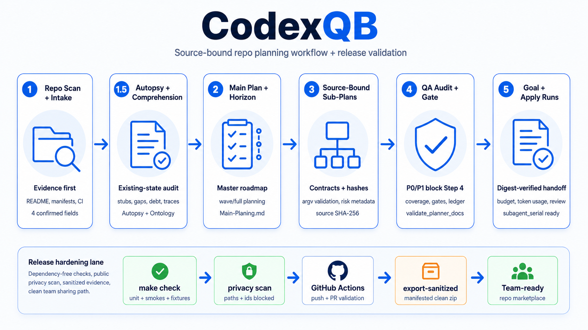

# CodexQB

[](https://github.com/alicankiraz1/CodexQB/actions/workflows/validate.yml)

**Vibecoding-first repo planning for Codex.** CodexQB turns a project repository into a durable planning package: main plan, existing-project autopsy, optional project comprehension, project ontology, planning ledger, phase sub-plans, QA audit, and a gated implementation handoff.



CodexQB is a Codex plugin that installs the `$codexqb` skill. It is built for software, AI, infrastructure, security, and automation projects where planning needs to be evidence-backed, reviewable, adaptive, and ready for small verified execution slices.

The current 0.3.0 release hardens CodexQB's Goal/Apply path from planning handoff through release evidence. Goal previews now bind every implementation contract to its source sub-plan path and SHA-256 hash, record stage-aware source snapshots, and separate expected mutable outputs from immutable planning inputs so normal Step 3/4 progress does not look like source drift. Apply runs carry the same source binding into task briefs, dispatch packets, reports, and results with contract digests, bounded budgets, honest token-usage reporting, and stricter validation around subagent attempts, fix cycles, writer locks, workspace drift, and review evidence.

Repository marketplace distribution remains hardened through dependency-free `make check`, GitHub Actions validation, deterministic fixture corpus checks, public release privacy scans, and sanitized exports through `make export-sanitized`. The feedback closeout now includes sanitized live `subagent_serial` Apply evidence for implementer, reviewer, fixer, security, final-review, finalization, and resume behavior; final release tagging remains a separate clean-provenance gate.

Release contracts:

```text
plugin_version: 0.3.0
artifact_schema_version: 3
handoff_contract_version: 2
goal_run_schema_version: 1
apply_run_schema_version: 1
budget_schema_version: 1
```

0.3.0 hardening highlights:

- Source-bound Goal and Apply artifacts: `source_subplan_path`, `source_subplan_sha256`, `implementation_contract_digest`, `task_contract_digest`, validation command IDs, parent acceptance signal IDs, risk class, and risk domains are propagated through generated run artifacts.
- Stage-aware resume safety: Goal runs snapshot immutable planning inputs while allowing expected mutable outputs such as Step 3 audits, Step 4 ledger updates, and declared implementation paths.
- Bounded execution metadata: Goal and Apply artifacts include `budget_contract`; Apply validation enforces selected-task, per-role attempt, and fix-cycle limits while reporting runtime token usage as `not_observed` unless a real usage source is available.
- Public release privacy checks: `make check-public-privacy` scans public docs and release evidence for local user paths, attachment paths, UUID-like attachment identifiers, and live Codex agent/thread IDs before release sharing.
- Sanitized live evidence: release evidence is redacted and reviewable, while raw local runtime logs stay out of public docs.

## Why CodexQB

- **Repo-aware intake:** CodexQB inspects the current repository before asking questions, then proposes evidence-backed defaults for project name, intent, target end state, constraints, autonomy/review cadence, and token/context budget assumptions.
- **Durable planning docs:** Output is written under `Planner-docs/` so long planning work, ontology, and implementation history survive context changes and can be reviewed like normal project documentation.
- **Project Autopsy + Ontology + Comprehension:** Existing projects get a focused `Autopsy.md` report and may get `Project-Ontology.md` plus `Project-Comprehension.md` to capture evidence confidence, CQ/TRACE/ARC links, architecture reflexion, quality scenarios, and open validation probes.
- **Adaptive phase decomposition:** The main plan can be expanded by active planning horizon in default `wave` mode, while later phases remain deferred roadmap cards unless the user explicitly requests `full` planning.
- **Implementation-ready planning gates:** Active sub-plans keep the 13-section human-readable structure and add a machine-readable implementation contract with repo-relative paths, exact validation commands, parent acceptance signal IDs, dependency labels, concrete outputs, and security review flags.
- **Structured command and risk contracts:** Step 2 contracts prefer `argv` validation commands with cwd, expected exit code, timeout, network, and probe tier fields. Strict validation uses shared safe command profiles and rejects shell chaining, command substitution, arbitrary `python -c`, unchecked shell scripts, unsafe path arguments, mutation/deploy intent, and high-risk work without security review.
- **QA before implementation:** The audit step checks coverage, naming, ordering, section structure, readiness, ontology consistency, planning-history continuity, framework ownership, algorithmic invariants, security/governance, vibecoding slice quality, and implementation preparedness.
- **Deterministic Goal specs, unique Goal runs:** `scripts/goal_run.py` compiles stage-aware source snapshots, Step 2 planning horizons from `Main-Planing.md` before sub-plans exist, active sub-plan inventory, source-bound Implementation Contracts, implementation contract digests, validation command IDs, contract-derived Step 4 work steps, Step 4 READY queues, subagent role plans, compiler version metadata, template bundle digests, budget metadata, and canonical handoffs into `Goal-Run.json`, `Goal-Prompt.md`, and `Goal-Result.json` without executing commands. `goal_spec_id` is stable for the same source/mode/objective/scope, while `goal_run_id` is unique per invocation. Missing stage prerequisites or failing bundled validator gates produce a blocked result instead of an execution prompt.
- **Gated execution handoff:** CodexQB does not implement product changes itself. It prints a separate Goal mode prompt only when the audit says implementation can begin, then guides that run through the READY queue in small verified slices and asks Step 4 to append concise implementation summaries to `Planing-Ledger.md`.
- **Artifact-based apply runs:** `scripts/apply_run.py` creates and validates `.codexqb/apply-runs/<apply-run-id>/` artifacts for `direct`, `subagent_serial`, `external_superpowers`, and `no_action` modes only after strict Step 4 validation passes. `apply_spec_id` is stable for the selected mode, source snapshot, workspace baseline, and READY queue; `apply_run_id` is unique per invocation. The immutable envelope records Git status, staged diff, unstaged diff, untracked inventory, non-Git file inventory, `working_branch`, `base_branch`, `worktree_path`, and `dirty_state` so resume validation can detect unrelated source/workspace drift while ignoring `.codexqb/` runtime artifacts. During implementation and review, validation permits only tracked, unstaged file drift that is both listed in the active Implementation Contract and reported in verified implementer/fixer artifacts; staged, untracked, or contract-external drift still blocks the run. Action modes reject non-Git workspaces by default unless the caller passes `--allow-non-git-unsafe`, and reject dirty or protected current Git worktrees unless the caller passes `--allow-unverified-git-worktree`; both approvals record `user_approval: true`. It derives task briefs from Step 4 READY audit entries and active sub-plan Implementation Contracts, carrying `source_subplan_sha256`, `implementation_contract_digest`, `task_contract_digest`, finding IDs, dependency state, exact planned validation commands, `validation_command_ids`, `security_review_required`, `budget_contract`, and `token_usage` metadata into `Progress.json`, `Brief.md`, reports, results, and subagent dispatch prompts. It prepares fresh-context Codex subagent dispatch packets for `subagent_serial`, records spawned/completed/failed agent lifecycle state, and rejects unsafe task IDs, no-action queues, unsafe validation commands, selected-task/attempt/fix-cycle budget overflow, silent progress overwrite, eventless state jumps, stale writer locks, missing dispatch packets, missing spawned/completed agent lifecycle records, source sub-plan hash or contract drift, workspace baseline drift outside approved implementation drift, agent profile drift, unchecked/unreconciled external Superpowers adapters, and VERIFIED tasks without implementation/review/final-validation evidence. Commit, push, PR, deploy, and external mutation remain opt-in.


## Vibecoding-First Behavior

CodexQB is intentionally vibecoding-first: it keeps the target vision clear, reads the repository's real shape, avoids fake certainty, and plans the next useful verified moves instead of freezing unnecessary implementation detail too early. Generated plans should favor small reversible slices, fast validation signals, explicit deferrals, and human-review checkpoints. Vibecoding never relaxes safety, secret handling, approval, validation, or file-boundary rules.

When a project is large or ambiguous, CodexQB may recommend or explicitly request bounded subagents for read-only repo exploration, readiness/security review, ontology mapping, phase drafting, Step 3 audit, or Step 4 implementation/review separation. The parent CodexQB agent remains responsible for final artifact writes.

## Workflow

| Step | What CodexQB Does | Output |
| --- | --- | --- |
| 1. Repo Scan + Main Plan | Reads the repository, asks four enriched intake questions, and creates the master plan. | `Planner-docs/Main-Planing.md` |
| 1.5 Autopsy + Ontology + Comprehension | For existing projects, audits current project structure and may capture vocabulary, evidence confidence, concept-to-code traces, architecture reflexion, quality scenarios, and open hypotheses. | `Planner-docs/Autopsy.md`, optional `Planner-docs/Project-Ontology.md`, optional `Planner-docs/Project-Comprehension.md` |
| 2. Phase Sub-Plans | Expands the active planning horizon into implementation-ready sub-plans and keeps later phases as deferred roadmap cards unless `full` planning is explicit. | `Planner-docs/Sub-Planing-Index.md`, `Planner-docs/Faz-*-Plans/*.md` |
| 3. QA Audit | Audits coverage, structure, quality, readiness, and governance without repairing files. | `Planner-docs/Sub-Planing-Audit.md` |
| 4. Gated Handoff | Prints a copy-ready implementation Goal prompt when Step 3 passes and tracks implementation summaries through the optional ledger. | Text-only Goal mode prompt, optional `Planner-docs/Planing-Ledger.md` updates |

Step 1 runs in the current Codex thread. Steps 2, 3, and 4 are intentionally handed off as text-only Goal mode prompts so the user stays in control of long-running work. Canonical Goal handoffs live under `references/handoffs/` and include the Goal Run Contract, resume/recovery protocol, validation gates, stop gates, context budget, source-snapshot binding, and subagent policy.

CodexQB 0.3.0 also includes optional local preview helpers:

```bash
python3 plugins/codexqb/skills/codexqb/scripts/goal_run.py --root /path/to/project --stage step2
python3 plugins/codexqb/skills/codexqb/scripts/apply_run.py prepare --root /path/to/project --mode subagent_serial
python3 plugins/codexqb/skills/codexqb/scripts/apply_run.py dispatch --run-dir /path/to/project/.codexqb/apply-runs/<apply-run-id> --task-id <task-id> --role implementer --actor controller --evidence "fresh dispatch prepared"
python3 plugins/codexqb/skills/codexqb/scripts/apply_run.py record-agent --run-dir /path/to/project/.codexqb/apply-runs/<apply-run-id> --task-id <task-id> --role implementer --agent-id <agent-id> --status spawned --actor controller --evidence "Codex subagent spawned"
python3 plugins/codexqb/skills/codexqb/scripts/apply_run.py transition --run-dir /path/to/project/.codexqb/apply-runs/<apply-run-id> --task-id <task-id> --to IMPLEMENTING --actor impl-1 --evidence "brief accepted"
python3 plugins/codexqb/skills/codexqb/scripts/apply_run.py recover-lock --run-dir /path/to/project/.codexqb/apply-runs/<apply-run-id> --task-id <task-id> --to NEEDS_CONTEXT --actor controller --evidence "writer lock expired"
python3 plugins/codexqb/skills/codexqb/scripts/apply_run.py reconcile --run-dir /path/to/project/.codexqb/apply-runs/<apply-run-id>
python3 plugins/codexqb/skills/codexqb/scripts/apply_run.py finalize --run-dir /path/to/project/.codexqb/apply-runs/<apply-run-id> --actor controller --evidence "final review passed"
```

Goal previews bind each structured implementation contract back to its source sub-plan path and SHA-256 hash, and they use stage-aware snapshots so expected Step 3/4 outputs do not falsely break resume while source drift still blocks. Apply artifacts carry the same source hash, implementation contract digest, task contract digest, bounded `budget_contract`, and honest `token_usage: not_observed` status through task briefs, dispatch packets, reports, and results.

These helpers write deterministic spec records with unique run directories inside the target repository and do not execute implementation, product validation, commit, push, PR, deploy, dependency install, or global Codex configuration changes. Apply runs record a `workspace_baseline` in `Apply-Run.json` with branch/base commit, Git status and diff hashes, untracked inventory hash, and non-Git file inventory hash when applicable. Non-Git action runs require explicit `--allow-non-git-unsafe` approval. Dirty or protected current Git worktrees require explicit `--allow-unverified-git-worktree` approval.
`Goal-Run.json` uses `goal_run_schema_version: 1`; `Apply-Run.json` uses `apply_run_schema_version: 1`. The packaged Apply runtime schema reference is `plugins/codexqb/skills/codexqb/references/apply-run-schema.json`; runtime validation remains dependency-free in `scripts/apply_run.py`.

## Quick Start

Add this repository as a Codex plugin marketplace:

```bash
codex plugin marketplace add alicankiraz1/CodexQB --ref main
codex plugin add codexqb@codexqb
```

If the repository is private, your Codex/GitHub environment must have access to `alicankiraz1/CodexQB`.

Start a new Codex thread in the project you want to plan, then ask:

```text
Use $codexqb to inspect this repo and plan this project.
```

CodexQB will inspect the repository briefly, then ask for:

- `PROJECT_NAME`
- `PROJECT_INTENT`
- `TARGET_END_STATE`
- `KNOWN_CONSTRAINTS`

CodexQB asks intake questions in the user's language when practical. Generated Planner-docs artifacts are English by default unless the user explicitly requests another content language. Required document headings remain English for validator stability. Intake should also surface desired autonomy, human review cadence, and any token/usage budget so CodexQB can describe rough Goal-mode cost/context risk without pretending to know exact spend.

Future language-mode work should add an explicit `PLANNER_DOC_LANGUAGE` or intake-level language setting. Until then, headings stay English and only body content should vary when the user requests another language.

For existing repositories, the questions include repo-derived suggestions. For empty or minimal repositories, CodexQB falls back to concise generic questions and marks repository evidence as limited.

## Generated Artifacts

CodexQB writes planning artifacts under the target project's `Planner-docs/` directory:

```text
Planner-docs/
  Main-Planing.md
  Autopsy.md
  Project-Ontology.md
  Project-Comprehension.md
  Planing-Ledger.md
  Sub-Planing-Index.md
  Sub-Planing-Audit.md
  Faz-0-Plans/
    Faz0.1-*.md
  Faz-1-Plans/
    Faz1.1-*.md
```

The `Planing` spelling is intentionally preserved because the bundled planner prompts and validators use these exact filenames.

Optional 0.3.0 runtime artifacts are written outside `Planner-docs/`:

```text
Planner-docs/
  Goal-Runs/<goal-run-id>/
    Goal-Run.json
    Goal-Prompt.md
    Goal-Result.json
.codexqb/
  apply-runs/<apply-run-id>/
    Apply-Run.json
    Progress.json
    Events.jsonl
    Writer-Lock.json
    AR-<apply-run-id>-T<nnn>/Brief.md
    AR-<apply-run-id>-T<nnn>/Dispatch-Packet.json
    AR-<apply-run-id>-T<nnn>/Agent-Run-<role>-<nn>.json
    AR-<apply-run-id>-T<nnn>/Implementer-Report.json
    AR-<apply-run-id>-T<nnn>/Review-Package.patch
    AR-<apply-run-id>-T<nnn>/Task-Review.json
    AR-<apply-run-id>-T<nnn>/Fix-Report.json
    Final-Review.json
    Result.json
```

`<goal-run-id>` and `<apply-run-id>` include invocation suffixes so repeated prepares do not collide. Apply task IDs use `AR-<apply-run-id>-T<nnn>` and resolve inside the apply-run directory. Use an explicit `--output-dir` plus `--resume` to continue an existing run, or `--replace` only when intentionally regenerating that directory.
The public JSON Schema reference for Apply runtime artifacts is bundled at `plugins/codexqb/skills/codexqb/references/apply-run-schema.json`.

## Evidence-Based Project Comprehension

`Planner-docs/Project-Comprehension.md` is optional and intended for medium or large existing projects. It records question-driven comprehension, evidence registers, confidence, domain-to-code trace maps, intended-vs-implemented architecture relations, bounded history/hotspot signals, quality scenarios, and open hypotheses with next probes.

Allowed evidence types are `source`, `test`, `runtime`, `history`, `configuration`, `documentation`, and `user-confirmed`. Confidence values are `confirmed`, `probable`, `tentative`, and `contradicted`. Step 2 turns tentative claims into validation work; Step 3 audits evidence quality and trace coverage; Step 4 verifies relevant assumptions before code changes.

## Validator

The skill includes a read-only validator:

```bash
python3 plugins/codexqb/skills/codexqb/scripts/validate_planner_docs.py --root /path/to/project --mode autopsy --strict
python3 plugins/codexqb/skills/codexqb/scripts/validate_planner_docs.py --root /path/to/project --mode step2 --strict
python3 plugins/codexqb/skills/codexqb/scripts/validate_planner_docs.py --root /path/to/project --mode step3-preflight --strict
python3 plugins/codexqb/skills/codexqb/scripts/validate_planner_docs.py --root /path/to/project --mode step3 --strict
python3 plugins/codexqb/skills/codexqb/scripts/validate_planner_docs.py --root /path/to/project --mode step4
```

Validator modes:

| Mode | Purpose |
| --- | --- |
| `step1` | Validate `Main-Planing.md`. |
| `autopsy` | Require `Autopsy.md` and validate optional ontology/comprehension/ledger continuity docs. |
| `step2` | Validate index, phase folders, sub-plans, and optional continuity docs. |
| `step3-preflight` | Validate Step 2 artifacts before `Sub-Planing-Audit.md` exists. |
| `step3` | Require and validate `Sub-Planing-Audit.md` after Step 3 writes it. |
| `step4` | Enforce semantic readiness, finding status, NO_ACTION_REQUIRED, and Ledger v3 strict execution gates. |

These commands are for manual validation from a CodexQB repository checkout. When running through an installed plugin, CodexQB should use the bundled validator path exposed by the active skill; if that path is unavailable, it should perform equivalent all-file validation and report the fallback clearly.

The validator checks required sections, schema frontmatter, optional ontology/ledger/comprehension headings and content, planning scope manifests, active/deferred phase consistency, deferred roadmap cards, structured implementation contracts, safe validation command schemas, risk/security review consistency, execution waves, parent acceptance traceability, decision references, framework ownership matrices, algorithmic invariant registers, normalized duplicate ratios, uniform sub-plan count anomalies, phase folders, filename conventions, index references, duplicate numbering, unindexed files, length-bounded secret patterns, and Step 4 readiness. Open P0/P1 audit findings block the implementation handoff. Open or accepted P2/P3 findings require `PASS_WITH_WARNINGS`; resolved/not_applicable P2/P3 findings do not keep the audit in warning state forever.

Repository maintainers can run the dependency-free repo check with:

```bash
make check
```

`make check` validates plugin JSON, required package files, `agents/openai.yaml` semantic fields, stale invocation names, tracked-file secret hygiene, archive hygiene, the apply-run CLI behavior smoke, the downstream Step 2 -> Step 4 Goal/Apply dry run, Goal/Apply prompt-size metric checks, the fixture corpus, and the unit test suite without requiring PyYAML or local Codex validator dependencies. Apply-run validation also requires any required or performed security review to record a `security_reviewer_agent_id` in `Task-Review.json`; that identity must differ from `implementer_agent_id`.

For a faster local unit-test loop, run:

```bash
make test
```

On a normal local development machine, `make check` is expected to finish under 45 seconds. A timeout or hang in validator tests is a release blocker, not a warning to ignore.

## Release Validation

Run this before sharing, committing, or pushing release changes:

```bash
make check
```

The repository also includes GitHub Actions at `.github/workflows/validate.yml`, which runs the same check on pushes to `main` and pull requests.

For sanitized zip sharing, use the sanitized export target instead of Finder or generic directory compression:

```bash
make export-sanitized
```

The underlying exporter defaults to tracked files only. The `make export-sanitized` target is release-oriented: it requires a clean Git worktree, fails when `HEAD` differs from `origin/main` if that ref is available, writes `PACKAGE-MANIFEST.json` with commit/branch/clean-tree/tree-hash provenance, and rejects symlinks, outside-root paths, blocked local/runtime paths, and length-bounded secret patterns. For pre-commit package checks that intentionally include worktree changes, use `make export-sanitized-worktree`; it still scans every included file. The default validation gate also checks that forbidden archive/package entries and missing package manifests are not present.

The feedback closure status for the 0.3.0 Goal/Apply hardening pass is tracked in `docs/FEEDBACK-CLOSURE-AUDIT.md`, with requirement-by-requirement status in `docs/release-audits/0.3.0-feedback-closure.md` and sanitized live subagent smoke evidence in `docs/release-evidence/0.3.0-live-subagent-smoke.md`. Public release evidence is privacy-scanned by `make check-public-privacy`; raw local runtime artifacts are not published unless they are intentionally redacted and reviewable. The local metric gate `python3 evals/run_goal_apply_metric_checks.py` reports deterministic size estimates for static Step 4 handoff text, dynamic direct/subagent Goal prompts, direct Apply briefs, and subagent dispatch prompts. The downstream dry-run gate `python3 evals/run_downstream_goal_apply_dry_run.py` builds a disposable git project, validates Step 2, Step 3 preflight, Step 3, and Step 4, compiles Goal previews, and finalizes a subagent Apply run without calling Codex tools. Treat remaining release-audit items in the closure audit as blockers before moving `CHANGELOG.md` from `Unreleased` to a dated final release section.

## Safety Model

CodexQB is planning-first. Steps 1-3 should not:

- implement product features;
- refactor source code;
- install dependencies;
- run destructive commands;
- commit, push, deploy, or open pull requests;
- write secrets, tokens, credentials, private keys, or local sensitive environment values into planning files.

Generated plans should distinguish documentation readiness, local readiness, live readiness, production readiness, and operational evidence.

## Repository Layout

```text
.agents/plugins/marketplace.json
.github/workflows/validate.yml
Makefile
plugins/codexqb/
  .codex-plugin/plugin.json
  skills/codexqb/
    SKILL.md
    agents/openai.yaml
    scripts/validate_planner_docs.py
    scripts/safety_contracts.py
    scripts/goal_run.py
    scripts/apply_run.py
    references/
      First-Planner.md
      Autopsy-Planner.md
      Second-Planner.md
      Third-Planner.md
      Fourth-Planner.md
      handoffs/
        run-step2.md
        run-step3.md
        run-step4.md
      repo-aware-intake.md
      workflow-quality.md
      vibecoding-principles.md
      subagent-playbook.md
      planning-ledger.md
      project-ontology.md
      project-comprehension-methods.md
      probe-policy.md
      assessment-and-budget.md
      engineering-principles.md
      goal-compiler.md
      apply-orchestrator.md
      goal-specs/
docs/
  INSTALLATION.md
  MAINTAINING.md
  USAGE.md
  assets/codexqb-workflow.png
evals/
  run_fixture_corpus_checks.py
scripts/
  validate.sh
tests/
CHANGELOG.md
LICENSE
README.md
```

## Documentation

- [Installation](docs/INSTALLATION.md)
- [Usage](docs/USAGE.md)
- [Maintaining CodexQB](docs/MAINTAINING.md)

## Contributing

Use GitHub issues for bugs, enhancements, and documentation requests. The issue templates ask for the CodexQB version, affected surface, validation evidence, and expected behavior so fixes can stay evidence-backed.

Before opening a pull request, run:

```bash
make test
make check
git diff --check
```

For release, packaging, or validation changes, also run:

```bash
make export-sanitized
```

Then extract `CodexQB-sanitized.zip` into a temporary directory and run `make check` there to prove package-level validation still works without `.git/`.

Pull requests should keep the existing compatibility contracts intact: preserve the `$codexqb` invocation, keep `Planing` filenames unchanged, keep validator checks dependency-free, avoid printing secret values, and do not weaken `export-sanitized` symlink, path-boundary, untracked-file, or content secret-scan guards.

## Community Supporters

CodexQB's hardening has benefited from concrete public feedback and PR proposals. Thank you to:

- [@ozanturcan](https://github.com/ozanturcan) for detailed issue reports and acceptance criteria that strengthened Step 1 validation, Step 3/4 gate clarity, package fallback behavior, and prompt wording.
- [@hsnyvsh](https://github.com/hsnyvsh) for PR proposals that helped shape the Step 1 validator test coverage, Step 4 handoff documentation, and the `make test` developer loop.

## Public Plugin Directory Status

CodexQB currently uses repository marketplace distribution. Public directory or workspace sharing distribution can be revisited separately; this release focuses on repo-marketplace installation and local/team validation.

## License

MIT. See [LICENSE](LICENSE).
